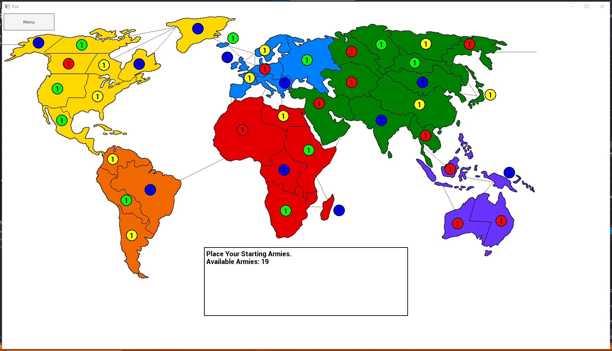

## Risk
A simplified version of the Risk board game implemented using C++ with the [SFML library](https://www.sfml-dev.org/index.php) and [TGUI](https://tgui.eu/).    
The game is currently in a prototype stage; game menus and game loop implemented with basic UI, but needs AI, code refactoring, and GUI touchups to complete.

### Compiling the Game
To compile and run the game both SFML and TGUI SDKs must be downloaded. It is recommended using Visual Studio and 
following both [SFML's tutorial](https://www.sfml-dev.org/tutorials/2.5/start-vc.php) and [TGUI's tutorial](https://tgui.eu/tutorials/0.10/visual-studio/)
for project configuration.  
sfml-graphics, sfml-window, sfml-system, and tgui libraries are required for successful compilation.

### Future Work
 - Implement AI for proper gameplay.
 - Improve GUI and visualization of game states and stats.
 - Code overhaul and refactoring - e.g. better leverage SOLID principles in the design.
 - Enable makefile support for project for simple install and use.
 - Flesh out game to include traditional Risk rules (select # of armies & dice per attack, cards for added reinforcements, etc.)
 - Generalize game to support additional maps and options (if Paradox can do it, so can this!)
 - Multithreading for multiplayer support over local network.
